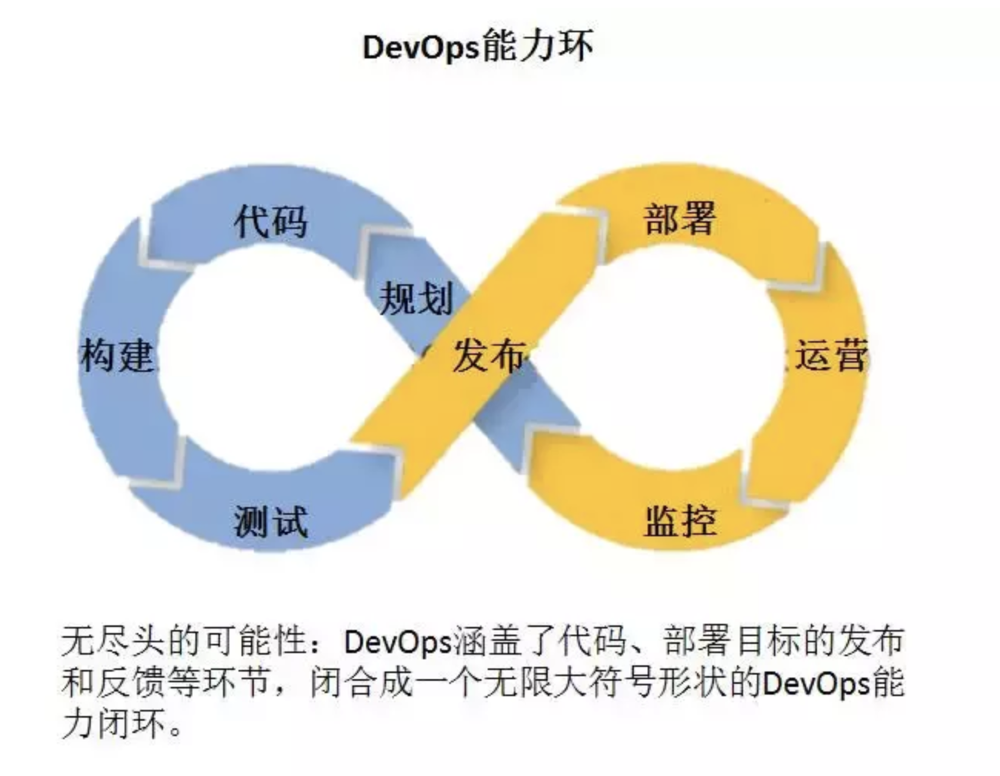

# DevOps

保证生产环境与部署环境一致。保证测试在部署环境下进行真实测试，而非生产环境。

> 高效交付,敏捷开发,自动部署,快速迭代,及时响应,快速交付价值，灵活响应变化.

## 基本原则
1. 高效的协作和沟通
2. 自动化流程和工具
3. 快速敏捷的开发
4. 持续交付和部署
5. 不断学习和创新

## 这世界变化太快,必须实现自动化

1. 代码管理
2. 构建工具
3. 自动部署
4. 持续集成
5. 配置管理
6. 容器
7. 编排
8. 服务注册与发现
9. 脚本语言
10. 日志管理
11. 系统监控
12. 性能监控
13. 压力测试
14. 报警
15. HTTP加速器
16. 应用服务器
17. Web服务器
18. 数据库
19. 项目管理